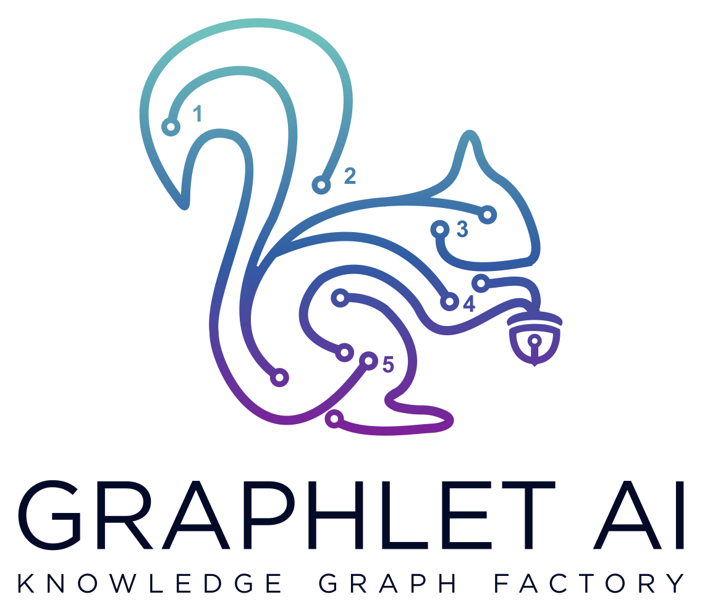

## Russell Jurney Founder

## 1555 Botelho, Dr. Ste 511 Walnut Creek, CA 94596
rjurney@graphlet.ai
Created: June 2, 2022 Updated: August 21, 2022

## Property Graph Factory
Extract, Transform, Resolve, Model, Predict, Explain
This document is an essay about building and using enterprise knowledge graphs in the form of property
graphs after reflecting on being CTO at three knowledge graph companies and outlines a gap in the open
source ecosystem and market where a Property Graph Factory fits to improve outcomes in risky, expensive
large knowledge graph projects. These projects can cost eight figures and fail to provide a return on
investment. An effective property graph factory can address the problems every enterprise knowledge
graph AI project encounters to cut the costs of building applications based on graph intelligence in half. This
document covers the process of building a knowledge graph using the most popular open source stack
before outlining the problems in this process that kill projects and the features in Graphlet AI that will solve
them.
I focus on process and technology rather than use cases because this essay is a net with which to gather
use cases that fit or alter the factory. I would appreciate feedback on this document in the form of
questions, comments and suggestions as I develop this idea. This is the philosophy of my new knowledge
graph consultancy Graphlet AI (website in progress). It is the driving ethos of our practice, it could be an
open source project under Apache governance or it could be a startup that disrupts the graph database
and knowledge graph markets by unblocking their growth by offering a platform that cuts the cost of
applications driven by enterprise knowledge graphs in half. Which do you think it is?

## INTRODUCTION
The workflow for the property graph factory described below defines the process that enables enterprises
to embrace and extend the data platforms they already use to build an enterprise knowledge graph with a
uniform ontology that represents the domain in which their business operates. On top of this domain
specific graph they can then use graph intelligence to add the types of edges in the solution space that
solve their business problems. In addition to network construction, a KG factory would allow companies to
easily do graph search, graph machine learning, and the rapid development of graph neural networks

-- Page Images --

