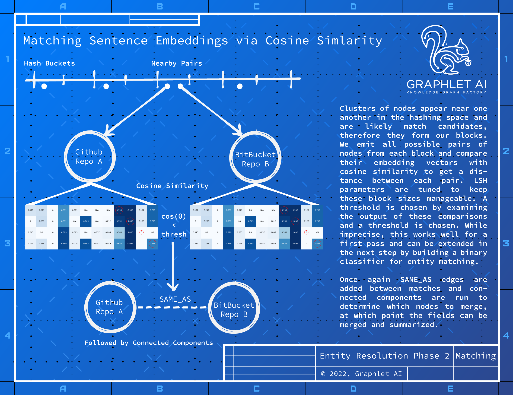

## Entity Matching 2.0: Fine Tuned Classification
Labeled data for fine-tuning a classifier using the sentence transformer representations can be obtained via
a labeling platform implementing active learning algorithms or by weak and distant supervision and
programmatic data labeling (see: Snorkel).
9

-- Page Images --

