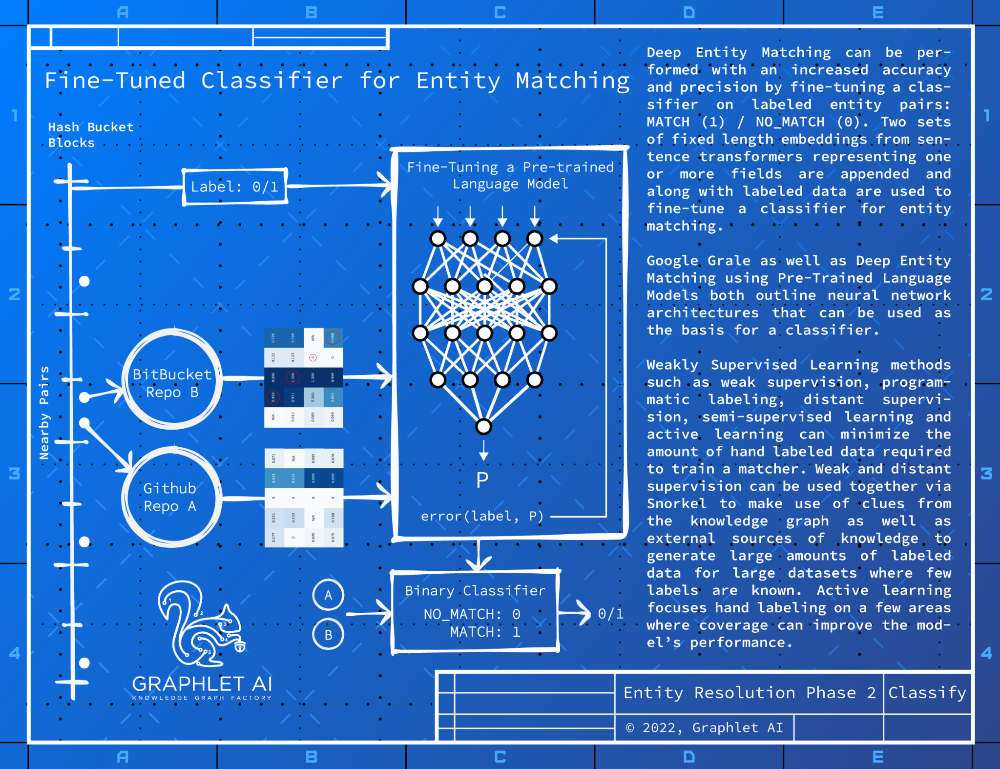

## Entity Matching 3.0: Hand Engineered Graph Features
The next phase of entity matching incorporates the topology surrounding a pair of nodes and incorporates
them as features in the matching classifier. In the example below the fields of companies can be compared
in the previous steps but in this phase the officer names and any fields describing them can be incorporated
into the embedded representation via the scheme described above, for the example of entity matching
between two companies below.
10

-- Page Images --

