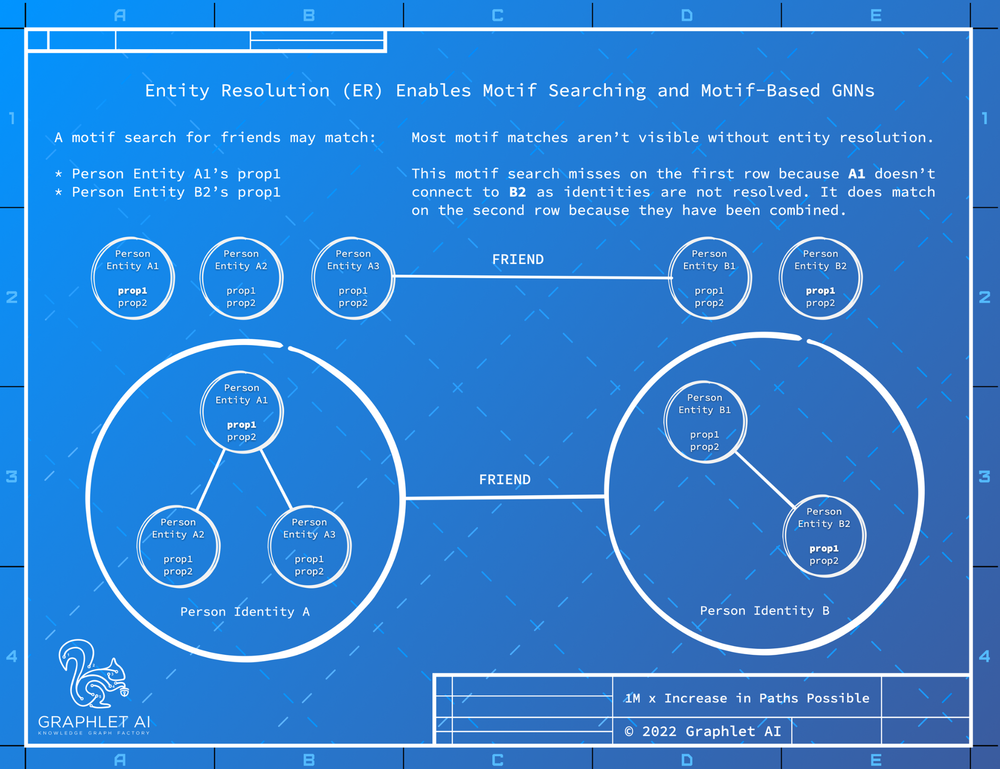

## Heterogenous Graphlets and their Minors
Query languages for property graphs enable rich queries for network motifs incorporating both topology
and node and edge properties. However, without first performing entity resolution, graph queries do not
return good results because hopping across edges misfires due to duplicate nodes. This is especially the
case on datasets and knowledge graphs that are themselves made up of disparate sources of nodes, edges
and their properties because there is heavy bias in what results and how many are returned. I have seen
match counts for a motif search to be as much one million times more frequent after entity resolution is
performed!

a network that allow the definition of a network defined not in the objects making up the problem domain
(companies, people, officerships) but describing the concepts of the actual problem (competitive conflicts,
financial secrecy or obscurity). Heterogenous graphlets are network motifs with numeric positions for
structural roles.
12
