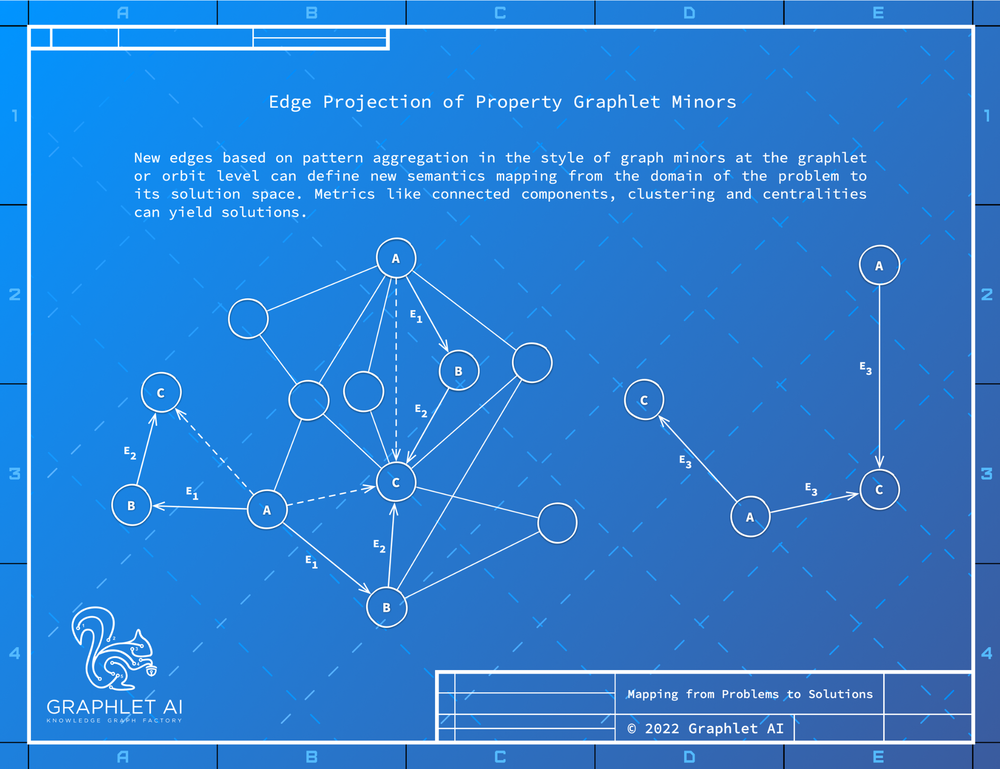

Heterogeneous graphlets are then merged by removing edges into graphlet level or orbit level nodes in a
process analogous to graph minors to create a concept level map of the problem space. This allows the
problem to be modeled such that one of two approaches can be used to solve a given business problem:
graph analytics or motif based graph representation learning, with the former being preferable as they are
simpler than the latter.

## Graphlet and Motif Representation Learning
In addition to being useful for network analysis, heterogenous graphlets are used by systems like GL2Vec
(code) as the basis for graph neural networks that perform representation learning by searching for the most
significant graphlets as a way to bootstrap higher level representations and fine tune them for a given task.
A simple approach to graphlet based learning is possible given that orbits representing structural roles in a
network are easily represented as a bitwise position in a vector. These orbit vectors can be used as input
for a graph neural network as they accept arbitrary input. A graph neural network can then learn deeper
representations with the graphlet concepts available from the beginning of training.
13

-- Page Images --

