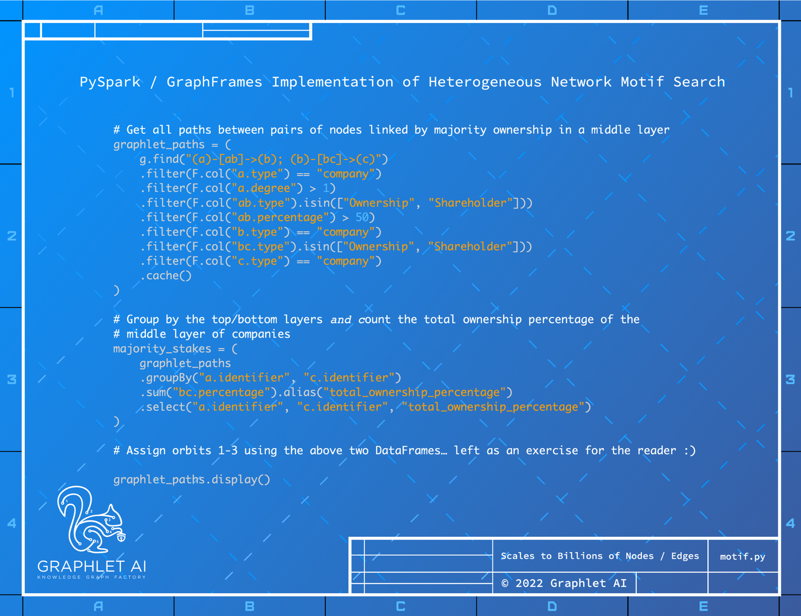

In the image below you can see how a graphlet can be computed over a business graph using a Spark
based library called GraphFrames that provides a powerful capability to search for network motifs which can
then be labeled with orbits corresponding to structural roles to create a heterogenous graphlet that can
then be used with the graphlet minors previously described or as a feature of a node or edge for a graph
neural network.
14

-- Page Images --

