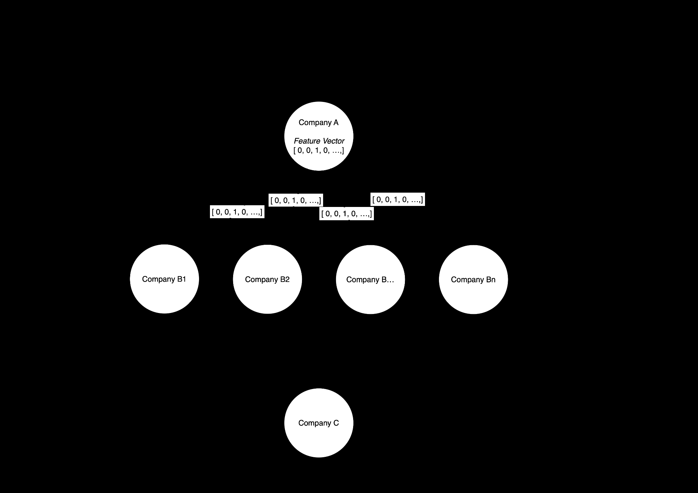

Complexity of graphlet search necessitates the incorporation of additional heterogenous graphlets defined
through graph queries in GraphFrames created in collaboration with domain experts into the graphlet
representation learning. Structural roles that relate to the solution to a downstream task will aid
performance and can be used in explainability. Systems like MotifExplainer use network motifs to explain
predictions, which can be visualized in the domain of the problem to explain weakly causal explanations to
users of an application. This work to incorporate pre-defined graphlets with graphlet searches as part of a
graph neural network architecture remains to be researched but is the key to understanding networks in an
application where the network itself as well as the models predictions are of interest to the user.
17

-- Page Images --

