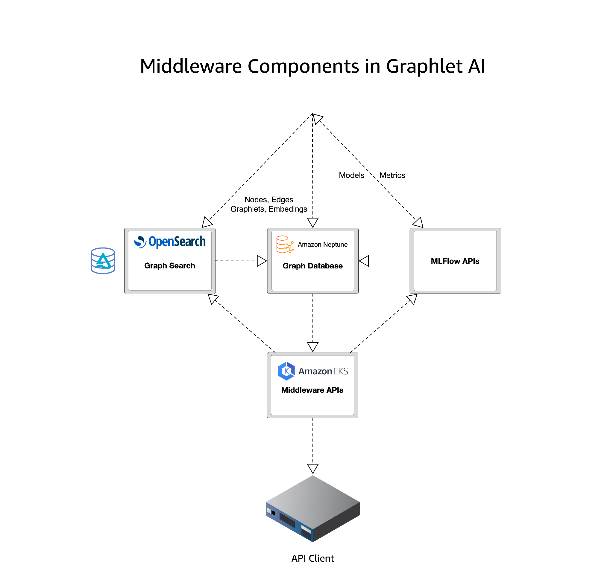

Once the ontology of the application graph is defined, the datasets making up the graph are transformed to
match this ontology. Representation learning describes the network. These representations power models
which add edges to the graph to create the type of relations needed to solve a given problem. These
models are applied to the network using batch inference with MLFlow.
Additional systems are needed to serve the edges to the graph that define our solution in the context of
their local neighborhoods: a search engine, graph database, version ML APIs and a middleware API server.
The user of a knowledge graph factory should be able to point-click create the above diagram to serve that
knowledge graph via an API. The queries can then be efficiently defined by the user and the system can
move into production efficiently.

## Vector Search
The representations of the nodes and edges in the network produced by training a graph neural network
(GNN) are vectors that can be used via Approximate K-Nearest Neighbor (ANN or A-KNN) or HSNW to
20

-- Page Images --

