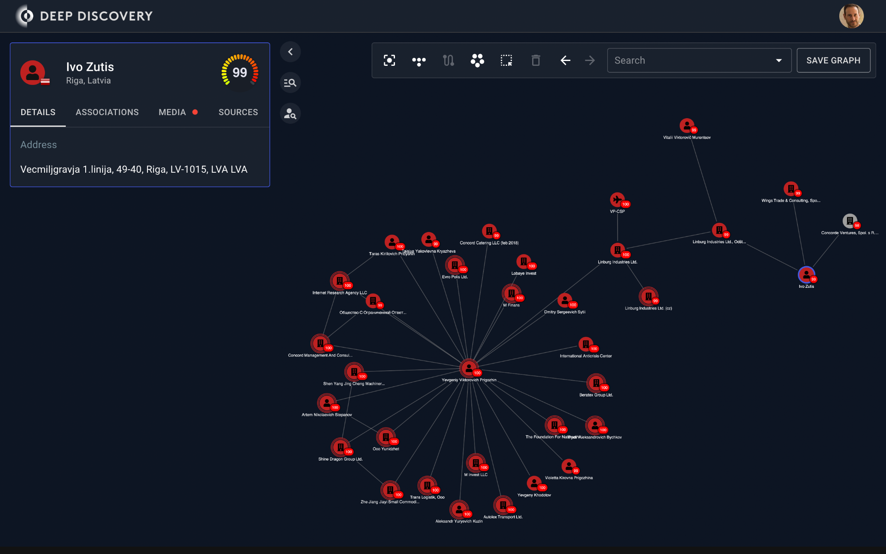

Systems like Graphistry can handle large scale network visualization but most explanations are in the local
network of the node or nodes of interest. These are retrieved based on the search criteria the user of the
application gives and which the search component of the factory sends the API. For smaller scale,
interactive network visualization Cambridge Intelligence offers a system called Keylines that has a React
wrapper called ReGraph. ReGraph allows you to define rich interfaces in a simple manner using skills
common among application developers such that expertise in network visualization is not required to build
interactive network visualizations.
A property graph factory should have an API layer for search and information retrieval along with a web
interface for visualizing networks that together enable application developers using the factory to produce
web and mobile apps that present and explain inferences and predictions in the business domain of the
end user.

## PROBLEMS AND SOLUTIONS
NOTE: THIS SECTION IS IN PROGRESS
The process defined above is executed by many organizations in one variation or another. It is never easy.
The scale of the data involved combined with frequent combinatorial scaling issues occurring with graphs.
22
