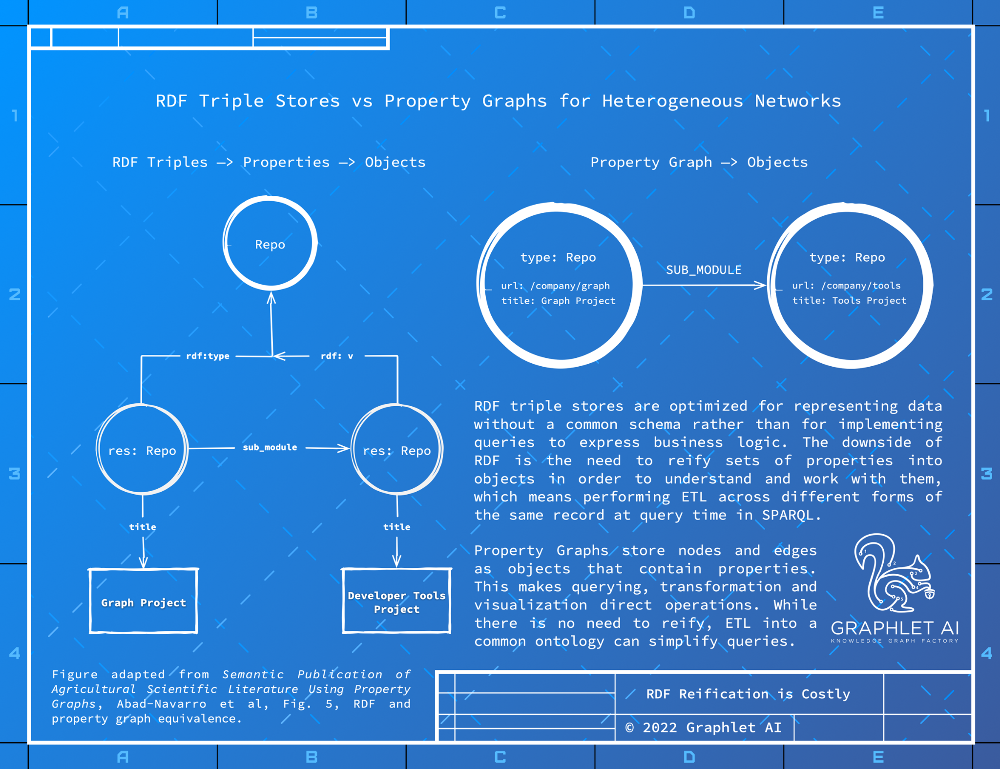

In reality most time is spent cleaning data - graph data isn’t in the format you need to solve your business
problems. You have multiple datasets in different formats, each with its quirks. You need to deduplicate data
using entity resolution - an unsolved problem in commercial tools for large graphs. Even once you merge
duplicate nodes and edges, you rarely have the edge types you need to think in terms of your problem
domain to make a problem easy to solve.
It turns out the most likely type of edge in a knowledge graph that solves your problem with analysis is
defined by the output of an entire program - a program in Python which employs machine learning. For
large graphs, this program needs to be run on a scalable platform based on commodity machines like
Databricks or Snowflake (which are improving using GPUs) and extend rather than rebuild and isolate within
to provide an excellent developer experience. To create new edges in the domain of your solution, you
need to compare candidate pairs nodes that are candidates for edges in an efficient manner. Google Grale
outlines a simple blocking or reduce mechanism for building a graph that solves your business problem
2
