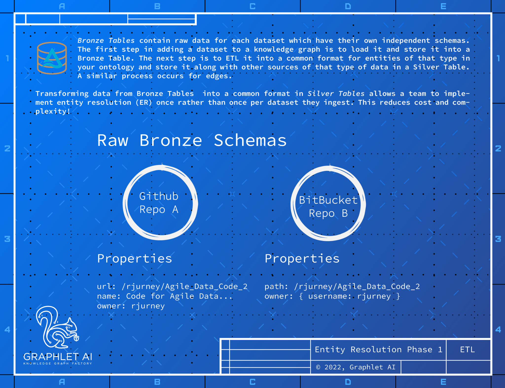

pipeline producing the knowledge graph from scratch is always uniquely versioned from end-to-end. Nodes
and edges can be stored in their own intermediate silver tables.

## Data Cleaning and ETL
Data from different sources about the same thing often contain different schemas, and for efficiency’s sake
it is necessary to transform - rather than link - the data into a single ontology representing your problem
domain. Multiple datasets need to be transformed into a single, generic form that fits the query and access
patterns for your application - for example Github, GitLab and BitBucket repositories can become Repos
with a type field referring to the source.
5

-- Page Images --

