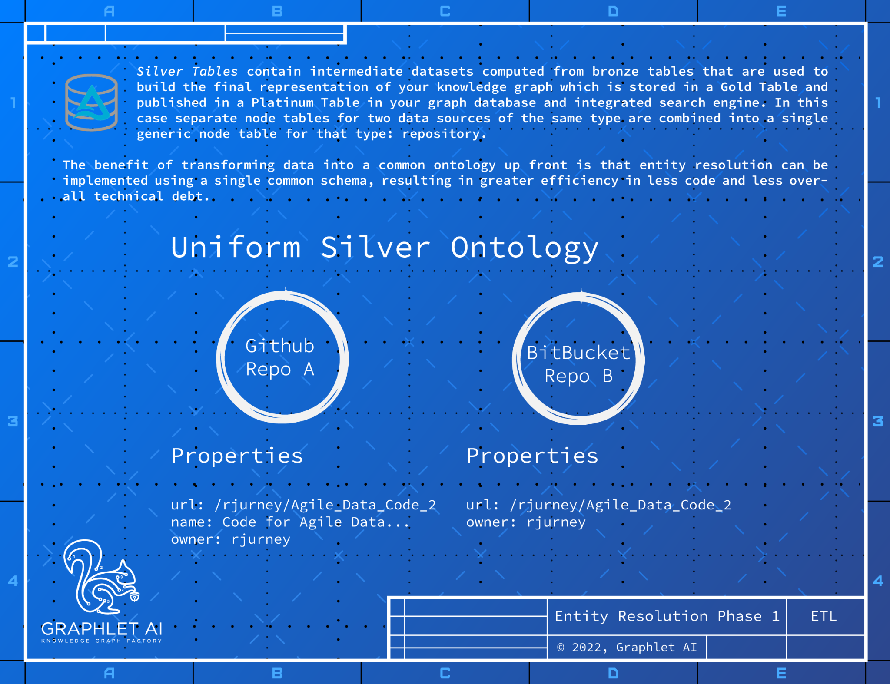

Tools for building Python classes for each domain’s application ontology are required to make ETL’ing
multiple bronze datasets into PySpark DataFrames or tables in SnowFlake. Classes for each type in the
ontology can be created from base classes provided by the system that use Python decorator functions to
define DataFrame or table schemas in a way that encourages code reuse.

## Entity Resolution

## The landmark paper Deep Entity Matching with Pre-Trained Language Models defined an encoding
mechanism for semi-structured records and embedded these representations using Sentence Transformers
to create vector representations of entities for entity matching. This turns out to be an excellent starting
point as an encoding mechanism for many graph ML tasks. Matching code for entity resolution is available
as part of the papers’ authors’ implementation ditto. This sentence transformer vector encoding can be
used for blocking and even matching via semantic similarity between structured records using cosine
similarity with a threshold, although a different model is used for matching via a fine-tuned classifier in the
ditto paper.
6

-- Page Images --

