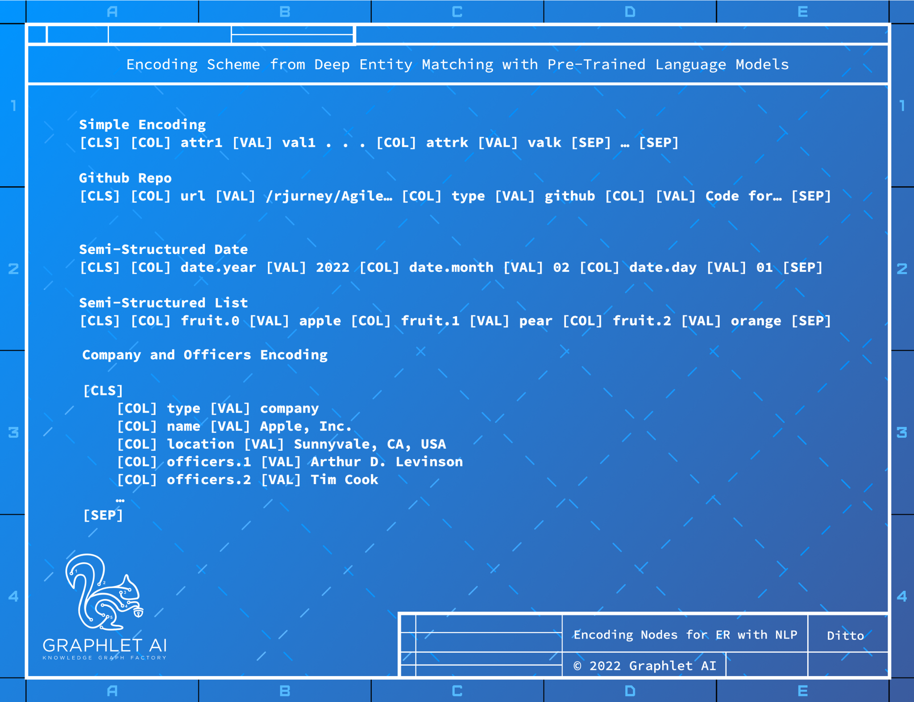

## Blocking with Locality Sensitive Hashing (LSH): Google Grale
Google Research put out a paper in 2020 about a system called Grale - the system that drives Google’s
internal knowledge graph factory for all its web properties. Similar to the reduce phase of MapReduce,
Grale uses a relatively simple, scalable algorithm called Locality Sensitive Hashing (LSH) to perform blocking
of nodes into similar groups for comparing pairs of nodes to perform tasks such as blocking for entity
resolution or link prediction. It can be thought of as MapLSH for the big graph ML space as compared to
MapReduce for general purpose big data processing.
It is critical to ship the simplest thing that could possibly work to production before moving on to more
sophisticated methods for any machine learning problem one pursues as premature optimization can be a
terminal flight pattern for any ML project. A knowledge graph factory should support and enable this
process through tools that enable stepwise implementation of solutions to link prediction problems.
A lightweight implementation of link prediction is possible for property graph nodes using the encoding
mechanism for structured records from ditto, which can represent semi-structured data including lists, maps
7

-- Page Images --

