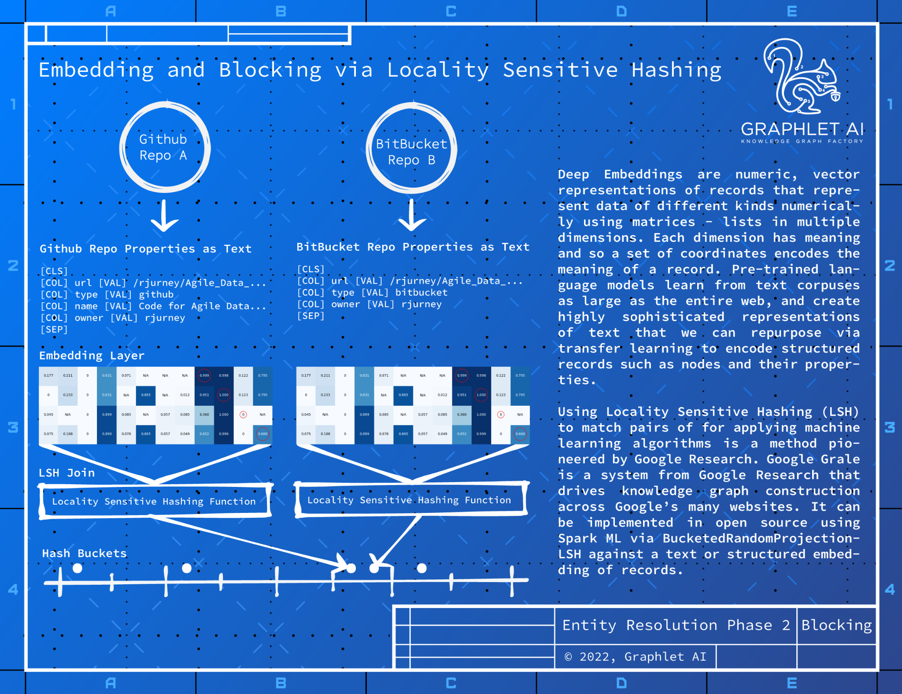

and trees. Sentence Transformers are used to encode the data. Spark ML’s BucketedRandomProjectionLSH
can act as the blocking mechanism for entity resolution. It offers a fuzzy join operator that can use any
vector such as a deep embedding to perform self-joins for link prediction tasks.
Spark ML’s LSH self-join on node records encoded using structural hints for pre-trained language models
provide a base capability to create the edges in your enterprise knowledge graph that form part of the
solution space via graph analytics whereas the provided edges usually lie in the problem space. The job of
a data science team using enterprise knowledge graphs is to transform a graph in the problem space to
one describing the solution space.

## Entity Matching 1.0: Cosine Similarity Thresholds
An prototype for fuzzy matching of nodes in property graphs can be created using cosine similarity between
the sentence embedding vectors and a hand-tuned threshold. This assures the practitioner of the
technique’s capabilities before investing more time and resources in a full implementation.
8

-- Page Images --

